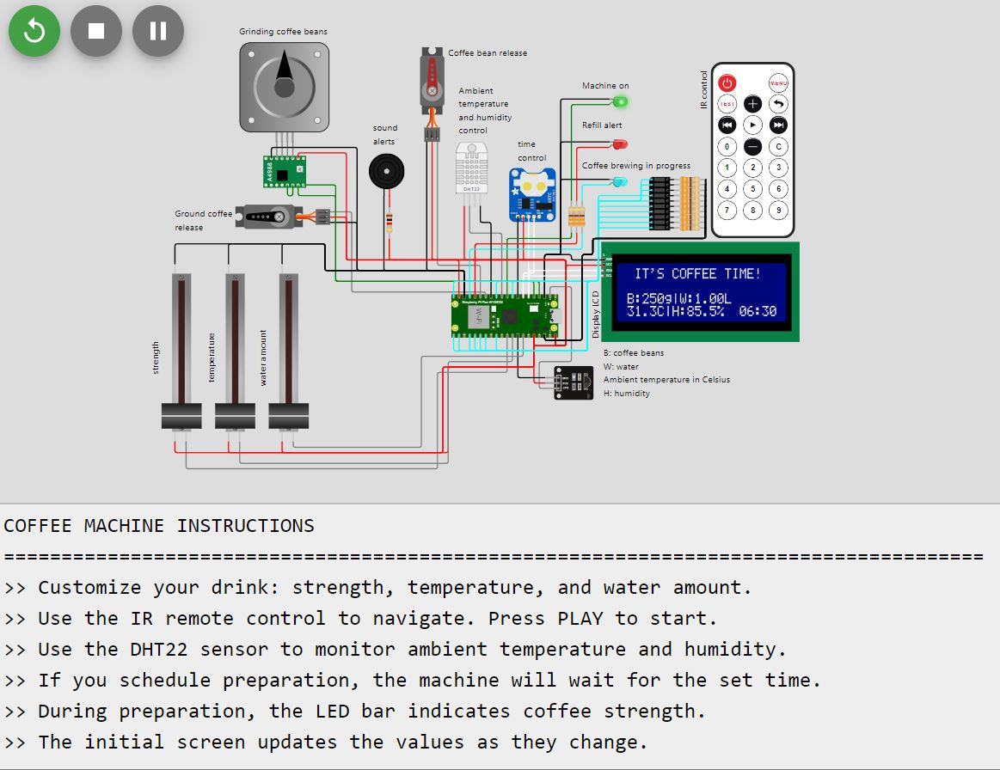

# Coffee Time - Smart Coffee Machine ☕ 
**_Final Project – EmbarcaTech Program_**  

## About the Project
Coffee Time is a smart coffee machine developed as the final project for the EmbarcaTech course, simulating personalized coffee preparation with adjustable strength, temperature, and quantity. The system integrates sensors and actuators for monitoring and control, fully simulated on the Wokwi platform.


## What is EmbarcaTech? 
**EmbarcaTech** is a professional training program aimed at university students in Information and Communication Technology (ICT) and related areas, focusing on **Embedded Systems and Internet of Things (IoT)**. The program consists of two phases:

1. **Online Training (3 months)** – Covers concepts and practical development in embedded systems.
2. **Technology Residency (12 months)** – Practical application of knowledge in case studies and projects in fields such as education, security, industry, and healthcare.
   
This project is part of the first phase of the program, serving as a practical example of IoT-based automation.

---

## Key Features
- Environmental temperature and humidity monitoring (DHT22 sensor).
- Personalized coffee customization: strength, temperature, and quantity.
- Coffee grinding and brewing simulation.
- Scheduled or immediate coffee preparation.
- Status indication on an LCD display and LED bar.
- Remote control for user interaction.



---

## Components Used
- **Raspberry Pi Pico W**
- **DHT22 Sensor** (Temperature and Humidity)
- **Stepper Motor**
- **Servo Motors**
- **Buzzer**
- **I2C LCD Display**
- **IR Remote Control**
- **RTC (Real-Time Clock) for scheduling**
- **Linear Potentiometers for strength, temperature, and water quantity adjustments**
- **LED Indicators and LED Bar for coffee strength display**
  
---

##  Simulation  
Check out the full simulation on Wokwi by clicking [here](https://wokwi.com/projects/422226074874479617). 


---

## How to Run the Project
1. Clone this repository: 
   ```
   git clone https://github.com/seu-usuario/coffeetime.git
   ```
2. Open the project on [Wokwi](https://wokwi.com) or in your local development environment.
3. Compile and run the code. Ensure all required libraries are available.

---

## Project Structure

```
📂 CoffeeTime-SmartCoffeeMachine
├── main.c                       → Main function and control loop
├── sensores.h / sensores.c       → ADC, DHT22, RTC readings, and resource verification
├── atuadores.h / atuadores.c     → Servo motors, stepper motor, and LED control
├── interface_usuario.h / interface_usuario.c → Menus, screens, and user interaction
├── estado.h / estado.c           → Machine state management and transitions
├── controle_ir.h / controle_ir.c → IR remote control event handling
└── lcd_i2c.h / lcd_i2c.c         → LCD display control
```

- **main.c**: Main project function, responsible for initialization and the main loop.
- **estado.c / estado.h**: Machine state management and transitions.
- **interface_usuario.c / interface_usuario.h**: Menus and user interaction.
- **processos_internos.c / processos_internos.h**: Initial setup and internal coffee preparation logic.
- **atuadores.c / atuadores.h**: Control of LEDs, servo motors, stepper motor, and buzzer.
- **sensores.c / sensores.h**:  Sensor data reading and processing.
- **controle_ir.c / controle_ir.h**: Handling and interpreting commands from the IR remote control.
- **lcd_i2c..c / lcd_i2c.h:** LCD display control.
---

## Future Improvements
- Add Wi-Fi connectivity for remote control via smartphone
- Implement a coffee strength learning algorithm
- Integrate a database for tracking coffee consumption

---

## License
This project is licensed under the MIT License. See the LICENSE file for details.

---

##   Author
```
Daniela Amorim de Sá
Electronic Engineer  | Embedded Systems & IoT
Project developed as part of the EmbarcaTech course.
```
